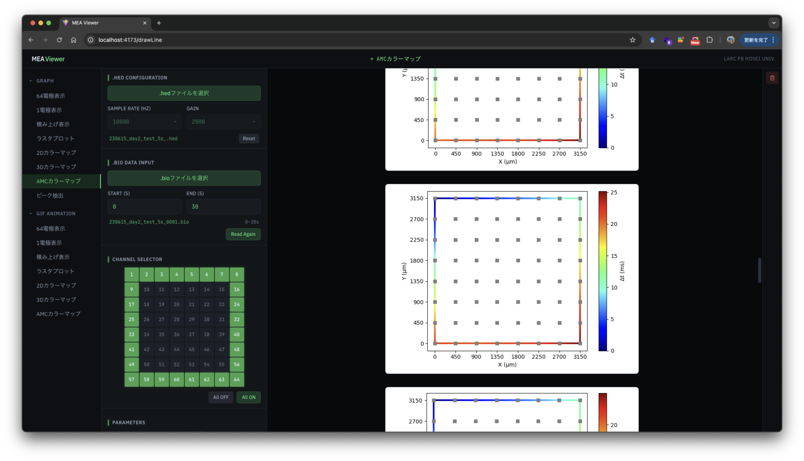

# MEA Viewer

MEA 計測データをブラウザ上で確認するアプリ



## 1. 環境構築

アプリケーションを docker-compose で動かす。

### Windows OS の場合

1. [Git install](https://qiita.com/T-H9703EnAc/items/4fbe6593d42f9a844b1c)
2. [Docker Desktop install](https://docs.docker.com/get-docker/)
3. Docker Desktop を起動した状態で、git bash (Git インストール時に同時に入る)で以下のコマンドを実行

初回のみ

```bash
mkdir ~/Workspace
cd ~/Workspace
git clone https://github.com/kkito0726/mea-viewer
bash ~/Workspace/mea-viewer/win-setup.sh
source ~/.bashrc
```

### Mac OS の場合

1. [Docker Desktop install](https://docs.docker.com/get-docker/)
2. Docker Desktop を起動した状態で、ターミナルで以下のコマンドを実行

初回のみ

```bash
mkdir ~/Workspace
cd ~/Workspace
git clone https://github.com/kkito0726/mea-viewer
bash ~/Workspace/mea-viewer/mac-setup.sh
source ~/.zshrc
```

## 2. アプリの実行

Docker Desktop を起動した状態で

```bash
mea-viewer
```

このコマンドで Docker コンテナが立ち上がり、ブラウザが開く。
PC 再起動や Docker Desktop を再起動した場合はこのコマンドをもう一度実行する。

### Docker コンテナを停止したい場合

```bash
docker compose -f ~/Workspace/mea-viewer/docker-compose.yml stop
```

## 3. アプリのアップデートをする場合

最新版のイメージを取得して再起動する

```bash
cd ~/Workspace/mea-viewer
git pull
docker compose pull
docker compose up -d
```

もしくはデータを初期化してバージョンアップする場合

```bash
cd ~/Workspace/mea-viewer
git pull
docker compose down
docker volume rm mea-viewer_mysql_data mea-viewer_minio_data
docker compose pull
docker compose up -d
```

### 古いイメージを削除する場合（任意）

以前のバージョンでローカルビルドしていた場合、古いイメージが残っています。
ディスク容量を節約したい場合は以下を実行してください。

```bash
docker rmi mea-viewer-server mea-viewer-client mea-viewer-go-backend
```

---

## 開発者向け

### ローカルでビルドする場合

```bash
cd ~/Workspace/mea-viewer
docker compose -f docker-compose.yml -f docker-compose.build.yml up -d --build
```

### pyMEA を最新版に更新してビルドする場合

```bash
cd ~/Workspace/mea-viewer
docker compose -f docker-compose.yml -f docker-compose.build.yml build --no-cache server
docker compose up -d
```

### イメージの自動ビルド

main ブランチにマージされると、GitHub Actions により自動的にイメージがビルドされ、GitHub Container Registry (ghcr.io) にプッシュされます。

---

## 技術スタック

### フロントエンド

- Vite + React + TypeScript
- Tailwind css

### バックエンド

- Python + Flask
- [PyMEA](https://github.com/kkito0726/MEA_modules), Matplotlib, etc...
- Go + Gin + Gorm
- mysql + minio
